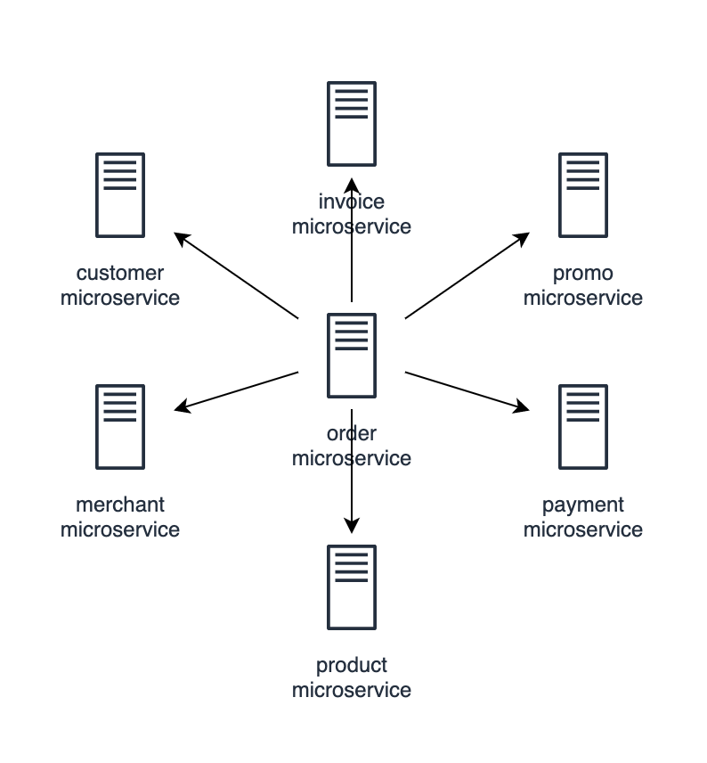

# Exploring Worker Pattern in Go

Imagine a `Domain` event called `Order.Placed`.
Each `Order.Placed` contains:

```json
{
    "customer": "CUST-001",
    "merchant": "MRCN-001",
    "payment": "CARD-001",
    "items": [
        {"id": "IT-001", "qty": 1},
        {"id": "IT-002", "qty": 2}
    ],
    "promo": "PROM-001"
}
```

Everytime an `order` is placed, there must be something in the `Backend` service that:

* Getting customer's detail
* Getting merchant's detail
* Getting promotion's detail
* Getting each product / item detail
* Calculate `sum` of the order and deduct it with promotion
* Make an `order` based on the gathered information, and notify it to `merchant`
* Make an `invoice` based on the gathered information, and notify it to `customer`
* Make a payment through `payment` service based on the `invoice`
* Flag the order `state` as `paid`
* Notify merchant that `payment` is done to said `order`
* Notify customer that `payment` success to said `invoice`

That's **Tremendously Ridiculous** amount of work needed to be done in the `Backend` side.
It sounds `wrong` to just make an `API` endpoint to handle these work, especially if your `Platform` can receive a ludicrous amount of order per minute across multiple region.

## Aggregate Root disguised as Actor

First of all, let's take on the rate of `order` issue.
`Order` can be placed at any time by millions of `customer` at the same time and the system must NEVER lose any of it.
System can defer processing an order by placing it in a `queue` which can be persisted and recovered in case of server restart, crash, or whatever disaster that comes.

Let's design an object called `Actor`

* An `Actor` is an object which `process` messages being sent to it
* So each `Actor` have an inbox which acts as a queue
* The inbox can contain any type of message, but usually 1 actor handle 1 kind of message
* The actor `processor` is a function delegated by its maker
* Each actor can only have 1 type of `processor` but can have multiple instance of it. Let's call it `worker`.
* A `processor` might, or might not produce a result
* A `processor` might, or might not produce an error

```go
package actor

// Processor is the delegate which process a message
// @worker is its assigned worker number (starts from 1) in case we make more than 1 worker
// @actor is the reference to which actor that receives the message
// @message is the current individual message from actor's inbox
type Processor func(worker int, actor *Actor, message interface{}) (interface{}, error)

// Exception handler in case processor produce an error
// @worker is its assigned worker number (starts from 1) in case we make more than 1 worker
// @actor is the reference to which actor that receives the message
// @err is the error that happened after trying to process a message
type Exception func(worker int, actor *Actor, err error)

// Options when initializeing an Actor
type Options struct {
    Worker      int              // number of worker / processor go routine, defaults = 1
    Output      chan interface{} // output channel, on which Actor will send in after process is done
}

// configure fallbacks to default
func (opt *Options) configure() {
    if opt.Worker <= 0 {
        opt.Worker = 1
    }
}

// Actor ...
type Actor struct {
    inbox     chan interface{}
    outbox    chan interface{}
    process   Processor
    exception Exception
}


// New instance of an Actor with w as number of worker
// @p is the processor function
// @e is the exception handler
func New(p Processor, e Exception, opt *Options) *Actor {
    opt.configure()

    actor := &Actor{
        inbox:     make(chan interface{}, opt.Worker),
        outbox:    opt.Output,
        process:   p,
        exception: e,
    }

    actor.start(0, opt.Worker)
    return actor
}

// start the actor with n number of worker
func (actor *Actor) start(idx, n int) {
    if idx == n {
        return
    }

    // worker number starts from 1
    go actor.work(idx + 1)
    actor.start(idx+1, n)
}
func (actor *Actor) work(w int) {
    for message := range actor.inbox {
        result, err := actor.process(w, actor, message)

        if err != nil && actor.exception != nil {
            actor.exception(w, actor, err)
            continue
        }

        if actor.outbox != nil {
            actor.outbox <- result
            continue
        }
    }
}

// Queue a message to inbox
func (actor *Actor) Queue(messages ...interface{}) {
    go func() {
        for _, message := range messages {
            actor.inbox <- message
        }
    }()
}
```

We'll test the actor with simple test case:

```go
func Test_Actor(t *testing.T) {
    word= [...]string{"One", "Two", "Three"}
    actor := New(func(w int, actor *Actor, message interface{}) (interface{}, error) {
        result := words[w-1]

        fmt.Println("worker", w,
            "receive", message,
            "processed as", result,
            "send to?", actor.outbox)

        return result, nil
    }, func(w int, actor *Actor, err error) {
        fmt.Println(err)
    }, &Options{Worker: 3})

    wg := sync.WaitGroup{}
    for i := 0; i <= 10; i++ {
        wg.Add(1)
        go func(i int) {
            idx := i % 3
            word := words[idx]
            actor.Queue(word)
            wg.Done()
        }(i)
    }

    wg.Wait()
}
```

* The test code creates an `actor` with 3 `worker`
* Each `worker` do the same type of job, which only returns word based on its worker number
* We loop 10 times and `queue` a word into the `actor`
* Lastly, we wait for the `wait group` to be done

```bash
robin.bastian$ go test -timeout=10s -run "^(Test_Actor)$"
worker 2 receive One processed as Two send to? <nil>
worker 2 receive One processed as Two send to? <nil>
worker 3 receive Two processed as Three send to? <nil>
worker 3 receive One processed as Three send to? <nil>
worker 1 receive Two processed as One send to? <nil>
worker 1 receive Three processed as One send to? <nil>
worker 1 receive Three processed as One send to? <nil>
worker 1 receive Two processed as One send to? <nil>
worker 1 receive One processed as One send to? <nil>
worker 2 receive Three processed as Two send to? <nil>
worker 3 receive Two processed as Three send to? <nil>
PASS
ok      github.com/bastianrob/go-experiences/generator/actor    0.006s
```

From the test results, we can see:

* Exactly 3 workers are spawned with one type of processor
* Order of message processed is **NOT** guaranteed
* Each process returns a `result` but is not being sent to `actor's` outbox

## Stopping the Actor

Next, we'll need a mechanism to `Stop` an `actor`. When an actor is stopped, we collect all pending messages and return it to the caller.

First of all, we add an exit mechanism to the `Actor` by adding:

```go
type Actor struct {
    ...
    // exit mechanism
    exit       chan struct{}
    workgroup  *sync.WaitGroup // worker waitgroup
    inboxgroup *sync.WaitGroup // inbox waitgroup
}

func New(p Processor, e Exception, opt *Options) *Actor {
    opt.configure()

    actor := &Actor{
        ...
        exit:       make(chan struct{}),
        workgroup:  &sync.WaitGroup{},
        inboxgroup: &sync.WaitGroup{},
    }

    actor.start(0, opt.Worker)
    return actor
}
```

* `exit` is an exit channel which will be used to signal each `worker` to stop processing a message
* `workgroup` is a wait group that counts how many worker is still active
* `inboxgroup` is a wait group that counts how many messages is still in the inbox

Next, we implement all of those `exit` mechanism:

* `inboxgroup` is added everytime a message is queued into `inbox`
* `workgroup` is added everytime a `worker` is spawned
* Each of it tries to listen to both `inbox` and `exit` channel by using `select case` statement
* `inboxgroup` is decreased everytime a message is done processed by a `worker`
* `workgroup` is decreased everytime a worker quits when it receives signal from `exit` channel

```go
func (actor *Actor) Queue(messages ...interface{}) {
    // add length of message to inbox wait group
    actor.inboxgroup.Add(len(messages))
    go func() {
        for _, message := range messages {
            actor.inbox <- message
        }
    }()
}

func (actor *Actor) work(w int) {
    actor.workgroup.Add(1)       // worker group is added
    defer actor.workgroup.Done() // defer flagging worker group as done

    for {
        select {
        case message := <-actor.inbox: // waits for message to come from inbox
            result, err := actor.process(w, actor, message)

            if err != nil && actor.exception != nil {
                actor.exception(w, actor, err)
                actor.inboxgroup.Done() // flag 1 message as done
                continue
            }

            if actor.outbox != nil {
                actor.outbox <- result
                actor.inboxgroup.Done() // flag 1 message as done
                continue
            }

            // flag 1 message as done
            actor.inboxgroup.Done()
        case <-actor.exit: // listen on exit signal
            return
        }
    }
}
```

Lastly, we implements the `Stop` method to:

* Close the `exit` channel so it is broadcasted to all `workers`
* Wait for all `workers` to finish exiting
* Gather the pending messages that's still lingering in `inbox`
* Decrease the `inboxgroup` counter everytime we finished collecting a message
* Wait for all pending messages to be collected
* Close the `inbox` channel
* And report all the pending messages to caller

```go
// Stop actor from processing any message
func (actor *Actor) Stop() (pendings []interface{}) {
    // stop all worker from processing any inbox
    close(actor.exit)
    actor.workgroup.Wait()

    // gather pending messages inside inbox and flag it as done
    go func() {
        for message := range actor.inbox {
            pendings = append(pendings, message)
            actor.inboxgroup.Done()
        }
    }()

    // wait for pending messages gathering to be completed and close the inbox channel
    actor.inboxgroup.Wait()
    close(actor.inbox)

    // return gathered pending messages
    return pendings
}
```

And now it's time to test the stop mechanism:

```go
func Test_ActorStop(t *testing.T) {
    mux := sync.Mutex{}
    var processed []interface{}
    actor := New(func(w int, actor *Actor, message interface{}) (interface{}, error) {
        mux.Lock()
        processed = append(processed, message)
        mux.Unlock()

        return nil, nil
    }, func(w int, actor *Actor, err error) {
        fmt.Println(err)
    }, &Options{Worker: 5})

    expected := 0
    for i := 1; i <= 100; i++ {
        go actor.Queue(i)
        expected = expected + i
    }

    pendings := actor.Stop()
    combined := append(processed, pendings...)

    sum := 0
    for _, e := range combined {
        sum = sum + e.(int)
    }
    if sum != expected {
        t.Error("Sum of 1-100 must be", expected, "but received", sum)
    }

    fmt.Println("PEND", pendings)
    fmt.Println("PROC", processed)
}
```

* The test code creates an `Actor` with 5 `workers`
* We feed the `actor` with number from 1 to 100
* So the `expected` sum of `1 + 2 + ... + 100` should be `5050`
* In the `processor` function, we collect all processed number into a variable called `var processed []interface{}`
* We use `mutex` to guard it because it will be accessed by 5 `workers` working from different go routine
* We then collect all pending numbers by calling `actor.Stop` and store it to a variable called `pendings`
* We combine both `processed` and `pendings` into slice called `combined` and `sum` all numbers inside it
* We compare the `sum` of all combined numbers with the `expected` number

```bash
robin.bastian$ go test -timeout=10s -run "^(Test_ActorStop)$"
PEND [7 21 8 22 10 23 63 24 57 25 26 27 28 29 30 31 73 64 65 66 67 68 58 59 60 61 62 71 70 79 74 75 76 77 69 78 72 82 80 81 84 83 85 86 93 87 88 89 90 91 92 96 94 95 98 97 99 100]
PROC [6 11 3 4 5 43 13 33 14 34 15 35 16 36 17 18 37 38 39 40 41 42 56 44 45 46 47 48 49 50 51 52 53 54 55 19 9 12 1 32 20 2]
PASS
ok      github.com/bastianrob/go-experiences/generator/actor    0.006s
```

## Directing Actors

Individually, an `actor` can do its job fine enough. But it will be better if we can chain `actors` together to build a pipeline processing!
So let's think of what we already have:

* Each actor have an `inbox` and `outbox`
* While inbox is `required`, an `outbox` is optional
* Now we want to chain output from one `actor` as input to another `actor`
* In other words: we can assign one `actor's` outbox with another `actor's` inbox

First, we'll have to refactor some of our `Actor's` code:

```go
type Options struct {
    ...
    Name        string // actor's name
    Output      *Actor // output actor, on which source actor will send a message after process is done
}

type Actor struct {
    ...
    // metadata
    name string
}

func (actor *Actor) work(w int) {
    ...

    for {
        select {
        case message := <-actor.inbox: // waits for message to come from inbox
            ...
            if actor.outbox != nil {
                actor.outbox.Queue(result)
                actor.inboxgroup.Done() // flag 1 message as done
                continue
            }
            ...
        }
    }
}
```

We added `name` to an `actor` so we can identify an `actor` easily.
And in the `worker`, if current `actor's` outbox is not nil, we queue the process output to next `actor`.

And then we write a function called `Direct`:

```go
package actor

// Direct inbox of a target actor, as source actor's outbox
func Direct(actors ...*Actor) {
    var source *Actor
    for _, target := range actors {
        if source == nil {
            source = target
            continue
        }

        source.outbox = target.inbox
        source = target
    }
}
```

Again, we'll write a test to ensure the behaviour is within expectation:

```go
func Test_ActorDirected(t *testing.T) {
    errPrinter := func(w int, actor *Actor, err error) {
        fmt.Println("worker:", w, "err:", err)
    }

    bale := New(func(w int, actor *Actor, in interface{}) (interface{}, error) {
        return in, nil
    }, errPrinter, &Options{
        Worker: 3,
        Name:   "Bale",
    })
    bane := New(func(w int, actor *Actor, in interface{}) (interface{}, error) {
        switch {
        case in == "I AM VENGEANCE":
            return "I AM INEVITABLE", nil
        case in == "I AM THE NIGHT":
            return "I AM BANE", nil
        case in == "I'M BATMAN":
            return "I WILL BREAK YOU", nil
        default:
            return nil, errors.New("WHATEVER YOU SAY")
        }
    }, errPrinter, &Options{
        Worker: 3,
        Name:   "Bane",
    })
    subtitle := New(func(w int, actor *Actor, in interface{}) (interface{}, error) {
        fmt.Println("worker:", w, "actor:", actor.name, "receive:", in)
        if in != "I AM INEVITABLE" && in != "I AM BANE" && in != "I WILL BREAK YOU" {
            t.Error("Bane's subtitle must be one of:", "I AM INEVITABLE", "I AM BANE", "I WILL BREAK YOU")
        }
        return nil, nil
    }, errPrinter, &Options{
        Worker: 3,
        Name:   "Subtitle",
    })

    Direct(bale, bane, subtitle)

    bale.Queue("I AM VENGEANCE", "I AM THE NIGHT", "I'M BATMAN", "HEY HO!")
    bale.Stop()
    bane.Stop()
    subtitle.Stop()
}
```

In this test, we:

* Have 3 `actors` named `Bale`, `Bane`, and `Subtitle`
* `Bale` will say `I AM VENGEANCE`, `I AM THE NIGHT`, `I'M BATMAN`, and `HEY HO!` to `Bane`
* `Bane` will say `I AM INEVITABLE`, `I AM BANE`, and `I WILL BREAK YOU` to `Subtitle`
* `Bane` will be confused by `HEY HO!` and responds `WHATEVER YOU SAY` to `errPrinter`
* `Subtitle` will print whatever `Bane` says

Test result shows:

```bash
robin.bastian$ go test -timeout 10s -run "^(Test_ActorDirected)$"
worker: 3 actor: Subtitle receive: I AM BANE
worker: 2 actor: Subtitle receive: I WILL BREAK YOU
worker: 1 actor: Subtitle receive: I AM INEVITABLE
worker: 2 actor: Bane err: WHATEVER YOU SAY
PASS
ok      github.com/bastianrob/go-experiences/generator/actor    0.006s
```

## Mocking Fake Microservices

Back to the example domain event in the beginning of this article, we have:



We have 7 microservices with `CRUD` implementation with `Order` microservice in the center of it all as the `Aggregate Root`.
We'll try to mock the `CRUD` implementation to all of the microservices:

```go
package mock

// CRUD contract
type CRUD interface {
    Get(id string) (interface{}, error)
    Create(dao interface{}) error
    Update(dao interface{}) error
}

// APIClient generic mock implementation of CRUD interface
type APIClient struct {
    GetFunc    func(id string) (interface{}, error)
    CreateFunc func(dao interface{}) error
    UpdateFunc func(dao interface{}) error
}

// Get mock, please implement GetFunc
func (ac *APIClient) Get(id string) (interface{}, error) {
    return ac.GetFunc(id)
}

// Create mock, please implement CreateFunc
func (ac *APIClient) Create(dao interface{}) error {
    return ac.CreateFunc(dao)
}

// Update mock, please implement UpdateFunc
func (ac *APIClient) Update(dao interface{}) error {
    return ac.UpdateFunc(dao)
}
```

* `CRUD` is a contract to imaginary API which
* `APIClient` is the mocked / fake implementation of a `CRUD`

We'll use these later to mock `CRUD` call all microservices.

Each of those microservice have their own data transfer object.
Let's call them: `dto`

```go
package dto

type Customer struct {
    ID    string
    Email string
    Name  string
}

type Invoice struct {
    ID       string
    Order    string
    Customer string
    Promo    string
    Subtotal int
    Discount int
    Total    int
}

type Merchant struct {
    ID    string
    Email string
    Name  string
}

type Payment struct {
    ID        string
    InvoiceID string
    MethodID  string // card, cash, balance, whatever
    Amount    int
}

type Product struct {
    ID    string
    Name  string
    Price int
}

type Promotion struct {
    ID       string
    Name     string
    Discount int // percentage
}
```

And since we're in the context of `order` we can access its data access object (`dao`):

```go
package dao

import "time"

// OrderItem DAO
type OrderItem struct {
    ID    string
    Name  string
    Qty   int
    Price int
}

// Order DAO
type Order struct {
    ID           string
    Date         time.Time
    State        OrderState
    CustomerID   string
    CustomerName string
    MerchantID   string
    MerchantName string
    Items        []*OrderItem
    Total        int
}
```

Lastly we create a `command` package which, as its name implies, command our `order` service to do something

```go
package command

// LineItem ordered item & qty
type LineItem struct {
    ID  string
    Qty int
}

// PlaceOrder command
type PlaceOrder struct {
    Customer string
    Merchant string
    Payment  string
    Promo    string
    Items    []LineItem
}
```

## Order as Aggregate Root

As we can see in the previous diagram, we need a service which orchestrate all required data from multiple services.
We call it `Aggregate Root`
In this case, it's in the `order` context, so let's start thinking about the flow:

* `Order` is working as the `Aggregate Root` so let's just call it `Root`
* `Root` can receive a command called `PlaceOrder` which contains all necessary information for `Root` to work
* Each time `Root` receives a message, it will orchestrate calls to multiple services needed to place an order

```go
package order

import (
    "errors"
    "fmt"
    "time"

    "github.com/bastianrob/go-experiences/generator/order/pkg/dao"
    "github.com/bastianrob/go-experiences/generator/order/pkg/dto"

    "github.com/bastianrob/go-experiences/generator/actor"
    "github.com/bastianrob/go-experiences/generator/mock"
    "github.com/bastianrob/go-experiences/generator/order/pkg/command"
)

// Services collection
type Services struct {
    Customer mock.CRUD
    Invoice  mock.CRUD
    Merchant mock.CRUD
    Order    mock.CRUD
    Payment  mock.CRUD
    Product  mock.CRUD
    Promo    mock.CRUD
}

// Config for order service
type Config struct {
    Worker   int
    Services Services
}

// Root aggregate root of order
type Root struct {
    *actor.Actor
    services Services
}

// NewAggregateRoot for order
func NewAggregateRoot(cfg *Config) *Root {
    root := &Root{
        services: cfg.Services,
    }

    n := cfg.Worker
    if n <= 0 {
        n = 10
    }

    worker := &actor.Options{Worker: n}
    root.Actor = actor.New(root.processor, root.exception, worker)

    return root
}

func (root *Root) processor(w int, a *actor.Actor, msg interface{}) (interface{}, error) {
    if msg == nil {
        return nil, errors.New("Order message is empty")
    }

    var customer *dto.Customer
    var merchant *dto.Merchant
    var promo *dto.Promotion

    // 1. Converts message to command
    cmd := msg.(*command.PlaceOrder)

    // 2. Fetch required information
    // Uses goroutine because we all have verbose if err
    errc := make(chan error)
    go func(errc chan<- error) {
        cust, err := root.services.Customer.Get(cmd.Customer)
        if err != nil {
            errc <- err
            return
        }
        customer = cust.(*dto.Customer)

        mcr, err := root.services.Merchant.Get(cmd.Merchant)
        if err != nil {
            errc <- err
            return
        }
        merchant = mcr.(*dto.Merchant)

        prm, err := root.services.Promo.Get(cmd.Promo)
        if err != nil {
            errc <- err
            return
        }
        promo = prm.(*dto.Promotion)

        errc <- nil
    }(errc)

    // 3. Wait for fetch to complete and listen to any error occurred
    if err := <-errc; err != nil {
        return nil, err
    }

    // 4. Get product details and calculate the total
    order := &dao.Order{
        Date:         time.Now(),
        State:        dao.New,
        CustomerID:   customer.ID,
        CustomerName: customer.Name,
        MerchantID:   merchant.ID,
        MerchantName: merchant.Name,
        Items:        make([]*dao.OrderItem, len(cmd.Items)),
    }
    for i, entry := range cmd.Items {
        it, err := root.services.Product.Get(entry.ID)
        if err != nil {
            return nil, errors.New("Failed to get item with ID: " + entry.ID)
        }

        item := it.(*dto.Product)
        order.Items[i] = &dao.OrderItem{
            ID:    item.ID,
            Name:  item.Name,
            Qty:   entry.Qty,
            Price: item.Price,
        }
        order.Total += (entry.Qty * item.Price)
    }

    // 5. Persist the order data to database
    err := root.services.Order.Create(order)
    if err != nil {
        return nil, errors.New("Failed to create a new order: " + err.Error())
    }

    // 6. Create the invoice through API
    discount := order.Total * promo.Discount / 100
    invoice := &dto.Invoice{
        Order:    order.ID,
        Customer: order.CustomerID,
        Promo:    promo.ID,
        Subtotal: order.Total,
        Discount: discount,
        Total:    (order.Total - discount),
    }
    err = root.services.Invoice.Create(invoice)
    if err != nil {
        // TODO: Recovery strategy, delete the order? or flag it if you wish
        return nil, errors.New("Failed to create a payment: " + err.Error())
    }

    // 7. Make a payment through API call
    payment := &dto.Payment{
        InvoiceID: invoice.ID,
        MethodID:  cmd.Payment,
        Amount:    invoice.Total,
    }
    err = root.services.Payment.Create(payment)
    if err != nil {
        // TODO: Recovery strategy to both order and invoice
        return nil, errors.New("Failed to create a payment: " + err.Error())
    }

    return order, nil
}

func (root *Root) exception(w int, a *actor.Actor, err error) {
    fmt.Println("Exception occurred at worker:", w, "with err:", err)
}
```

As we can see in the code above:

* `Root` owns an `Actor`
* The `processor` is an `actor's` processor which orchestrate all call to multiple services

Now let's test the code by writing a test:

```go
package order

import (
    "errors"
    "fmt"
    "sync"
    "testing"
    "time"

    "github.com/bastianrob/go-experiences/generator/actor"
    "github.com/bastianrob/go-experiences/generator/mock"
    "github.com/bastianrob/go-experiences/generator/order/pkg/command"
    "github.com/bastianrob/go-experiences/generator/order/pkg/dao"
    "github.com/bastianrob/go-experiences/generator/order/pkg/dto"
)

func Test_OrderAsAggregateRoot(t *testing.T) {
    customerAPIMock := &mock.APIClient{
        GetFunc: func(id string) (interface{}, error) {
            time.Sleep(20 * time.Millisecond) // simulate 20ms latency
            return &dto.Customer{
                ID:   id,
                Name: "I am your customer",
            }, nil
        },
    }
    merchantAPIMock := &mock.APIClient{
        GetFunc: func(id string) (interface{}, error) {
            time.Sleep(20 * time.Millisecond) // simulate 20ms latency
            return &dto.Merchant{
                ID:   id,
                Name: "I am your merchant",
            }, nil
        },
    }
    promotionAPIMock := &mock.APIClient{
        GetFunc: func(id string) (interface{}, error) {
            time.Sleep(20 * time.Millisecond) // simulate 20ms latency
            return &dto.Promotion{
                ID:       id,
                Name:     "10% discount",
                Discount: 10,
            }, nil
        },
    }
    invoiceAPIMock := &mock.APIClient{
        CreateFunc: func(obj interface{}) error {
            time.Sleep(20 * time.Millisecond) // simulate 20ms latency
            inv := obj.(*dto.Invoice)
            inv.ID = "INV-001"
            return nil
        },
    }
    orderAPIMock := &mock.APIClient{
        CreateFunc: func(obj interface{}) error {
            time.Sleep(20 * time.Millisecond) // simulate 20ms latency
            inv := obj.(*dao.Order)
            inv.ID = "INV-001"
            return nil
        },
    }
    paymentAPIMock := &mock.APIClient{
        CreateFunc: func(obj interface{}) error {
            time.Sleep(20 * time.Millisecond) // simulate 20ms latency
            pay := obj.(*dto.Payment)
            pay.ID = "PMT-001"
            return nil
        },
    }
    productAPIMock := &mock.APIClient{
        GetFunc: func(id string) (interface{}, error) {
            time.Sleep(20 * time.Millisecond) // simulate 20ms latency
            switch id {
            case "ITEM-001":
                return &dto.Product{
                    ID:   id,
                    Name: "I am item 001",
                }, nil
            case "ITEM-002":
                return &dto.Product{
                    ID:   id,
                    Name: "I am item 002",
                }, nil
            }
            return nil, errors.New("404")
        },
    }

    // root is order actor which acts as an aggregate root
    // have by default 10 workers
    root := NewAggregateRoot(&Config{
        Worker: 20,
        Services: Services{
            Customer: customerAPIMock,
            Merchant: merchantAPIMock,
            Invoice:  invoiceAPIMock,
            Order:    orderAPIMock,
            Payment:  paymentAPIMock,
            Product:  productAPIMock,
            Promo:    promotionAPIMock,
        },
    })

    // waiter is an actor which hears from root and keep tracks of how many order have we done processing
    wg := &sync.WaitGroup{}
    wg.Add(100)
    waiter := actor.New(
        func(w int, a *actor.Actor, message interface{}) (interface{}, error) {
            wg.Done()
            return nil, nil
        },
        func(w int, a *actor.Actor, err error) {
            wg.Done()
        },
        &actor.Options{Worker: 10},
    )

    // clock in to check how long we're porcessing 100 command
    start := time.Now()

    // place order 100 times
    var orders []interface{}
    for i := 0; i < 100; i++ {
        orders = append(orders, &command.PlaceOrder{
            Customer: "CUST-001",
            Merchant: "MRCN-001",
            Payment:  "CARD-001",
            Promo:    "DISC-10",
            Items: []command.LineItem{{
                ID:  "ITEM-001",
                Qty: 1,
            }, {
                ID:  "ITEM-002",
                Qty: 1,
            }},
        })
    }
    root.Queue(orders...)

    actor.Direct(root.Actor, waiter)
    fmt.Println("We are waiting")
    wg.Wait()

    // we have at least 7 fake services and each takes simulated 20ms to complete
    // so total time it takes to complete 100 command * 140ms = 14sec
    // 14 sec if we only have 1 worker.
    // Ideally we can cut it down to minimal of 0.7sec because we have 20 workers
    dur := time.Since(start)
    if dur.Seconds() >= 1. {
        t.Error("Total processing time should not exceed 1sec")
    }

    fmt.Println("Duration:", dur)
}
```

In the test:

* We mock all API call by using the `mock.APIClient`. In real world, this might be a gRPC call.
* Each API call is given `20ms` sleep to simulate latency
* We instantiate an `Aggregate Root` and give it `20 workers`
* We have total of `7 services` and each call cost `20ms` so 1 message processing time should cost around `140ms`
* We give `100 command` to the `Aggregate Root`
* If each command takes `140ms` processing time, and we're giving `100`. Total time it takes is `14000ms` or `14s` if done serially
* But we give `20 workers` to the `Aggregate Root` so the fastest we can achieve is `t = 14s / 20 = 0.7s`
* We direct `Aggregate Root's` output to another actor called `waiter`
* The `waiter` simply waits for `Aggregate Root` to finish processing 100 commands.
* And then we track the duration it takes for `Aggregate Root` to complete 100 commands.

```bash
robin.bastian$ go test -timeout 3s -run "^(Test_OrderAsAggregateRoot)$"
We are waiting
Duration: 881.459161ms
PASS
ok      github.com/bastianrob/go-experiences/generator/order/internal   0.888s
```

## Distributed Processing

Now imagine `100 order placed / sec` in the test case above is not enough.
We can make a cluster of `Aggregate Root`, have them listen to a message broker like `NSQ` or `RabbitMQ`, and let the message broker handle the load balancing.